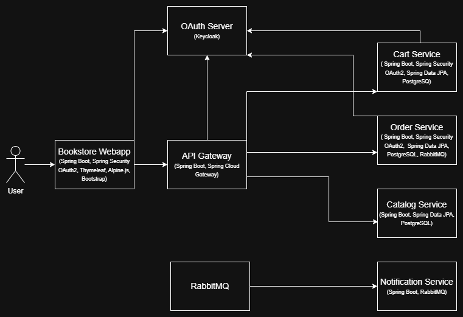

# Bookstore Microservice 

A simple bookstore app. Implements essential functionalities of a online bookstore such as:

- Order placement
- User/guest carts 
- email notificaations
- Order tracking

## Overview

The architecture is designed using a microservice approach to ensure scalability, maintainability, and security. The components interact through APIs and messaging queues while leveraging OAuth2 authentication and authorization provided by Keycloak.

---

## Modules and Components

### 1. **Bookstore Webapp**
- **Description**: The frontend of the bookstore application, accessible to end users.
- **Technologies**: 
  - Spring Boot
  - Spring Security (OAuth2)
  - Thymeleaf
  - Alpine.js
  - Bootstrap
- **Responsibilities**:
  - User interaction and presentation layer.
  - Authentication and authorization through OAuth2.
  - Routing user requests to the API Gateway.

---

### 2. **API Gateway**
- **Description**: Acts as a unified entry point for all client requests to the backend services.
- **Technologies**:
  - Spring Boot
  - Spring Cloud Gateway
- **Responsibilities**:
  - Request routing.

---

### 3. **OAuth Server**
- **Description**: Handles authentication and authorization for all services.
- **Technologies**:
  - Keycloak
- **Responsibilities**:
  - Issue OAuth2 tokens.
  - Manage users, roles, and permissions.

---

### 4. **Cart Service**
- **Description**: Manages shopping cart functionality.
- **Technologies**:
  - Spring Boot
  - Spring Security (OAuth2)
  - Spring Data JPA
  - PostgreSQL
- **Responsibilities**:
  - CRUD operations for user/guest carts.
  - Persist cart data in PostgreSQL.

---

### 5. **Order Service**
- **Description**: Manages order processing.
- **Technologies**:
  - Spring Boot
  - Spring Security (OAuth2)
  - Spring Data JPA
  - PostgreSQL
  - RabbitMQ
- **Responsibilities**:
  - Create and manage orders.
  - Interact with RabbitMQ for asynchronous processing.

---

### 6. **Catalog Service**
- **Description**: Provides product catalog data.
- **Technologies**:
  - Spring Boot
  - Spring Data JPA
  - PostgreSQL
- **Responsibilities**:
  - CRUD operations for product data.
  - Serve catalog information to other services.

---

### 7. **Notification Service**
- **Description**: Sends notifications for events like order status updates.
- **Technologies**:
  - Spring Boot
  - RabbitMQ
- **Responsibilities**:
  - Listen to RabbitMQ messages for event-driven notifications.
  - Send email or other notifications to users.

---

### 8. **RabbitMQ**
- **Description**: Messaging broker for asynchronous communication between services.
- **Technologies**:
  - RabbitMQ
- **Responsibilities**:
  - Enable event-driven architecture.
  - Provide reliable message queuing.

---

## Communication Flow

1. The user interacts with the **Bookstore Webapp**.
2. The **Bookstore Webapp** forwards requests to the **API Gateway**.
3. The **API Gateway** routes the requests to appropriate services such as:
   - **Cart Service**
   - **Order Service**
   - **Catalog Service**
4. The **OAuth Server** validates and issues tokens to secure the communication.
5. Asynchronous events are handled by **RabbitMQ**, consumed by the **Notification Service**.

---

## Database Configuration

Each service that requires data persistence uses PostgreSQL, ensuring isolation and scalability. The databases are as follows:
- `Cart Service` Database
    - `Guest Cart` Database
- `Order Service` Database
- `Catalog Service` Database

---

## Security

- **OAuth2 Authentication**: All services are secured using OAuth2 with Keycloak as the identity provider.
- **Role-Based Access Control (RBAC)**: Keycloak manages user roles and permissions.

---

## Deployment

- All services are containerized using Docker and orchestrated through Docker Compose or Kubernetes.
- Each service runs independently, allowing for easy scaling and deployment.

---

## Diagram

